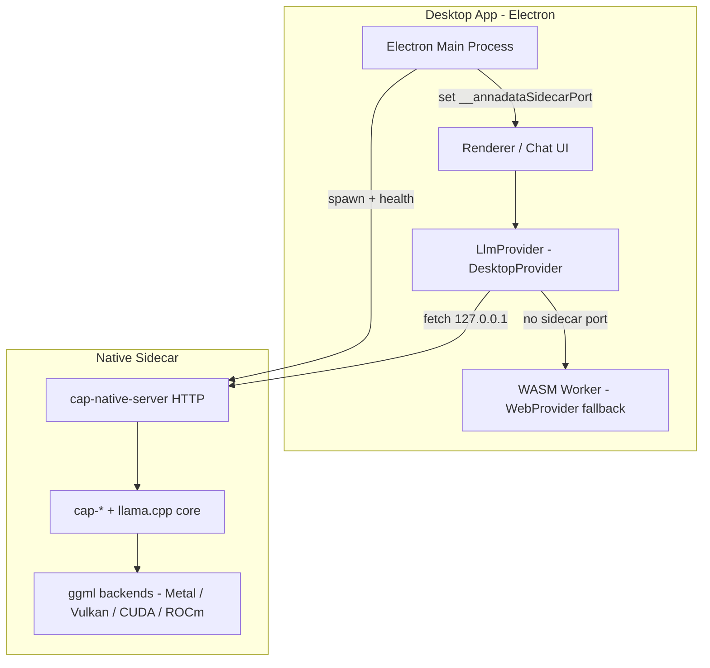

# Desktop Architecture — Windows, macOS, Linux

**Version:** 0.2.0  
**Reference:** `ref-code/annadata-vad-dt` (Electron + sidecar pattern)  
**Status:** Foundation implemented — sidecar build, GPU probing, isomorphic provider

---

## Executive Summary

Desktop support extends the existing **iOS + Android + PWA** stack with a fourth target:

| Platform | Shell | Inference path | Acceleration |
|----------|-------|----------------|--------------|
| **Windows** | Electron (recommended) | Native sidecar + WASM fallback | Vulkan, CUDA, ROCm, OpenVINO (Intel GPU/NPU) |
| **macOS** | Electron | Native sidecar + WASM fallback | Metal, CoreML ANE |
| **Linux** | Electron / AppImage | Native sidecar + WASM fallback | Vulkan, CUDA, ROCm, OpenVINO |

The design mirrors **annadata-vad-dt**: a **dual pipeline** where a native **sidecar binary** provides GPU/NPU acceleration via localhost HTTP, and the existing **WASM worker** remains the universal CPU fallback.

---

## Architecture Diagram



---

## Repository Layout (new)

```
annadata-llama-cpp/
├── sidecar/
│   ├── CMakeLists.txt          # SIDECAR_VARIANT builds (metal, vulkan-openblas, cuda, rocm, cpu)
│   ├── cap-sidecar-main.cpp    # Standalone main → cap_llama_server_main
│   └── bin/                    # Staged binaries (dev + packaging)
├── cmake/
│   ├── desktop-sources.cmake   # Shared cpp/ source list
│   └── ggml-backends.cmake     # Optional upstream ggml GPU plugin build
├── desktop/
│   └── src/main/               # Electron main-process modules (CommonJS)
│       ├── gpu-probe.cjs       # NVIDIA / AMD / Intel / Vulkan detection
│       ├── backend-selector.cjs
│       ├── sidecar-manager.cjs
│       ├── sidecar-client.cjs
│       └── model-store.cjs
├── extraResources/sidecar/       # Pre-built binaries for electron-builder CI
└── src/isomorphic/
    ├── provider.desktop.ts     # HTTP sidecar + WASM fallback
    └── desktop.runtime.ts      # Electron detection
```

---

## Accelerator Matrix

| Vendor | Hardware | Backend | Build variant | Runtime detection |
|--------|----------|---------|---------------|-------------------|
| **Apple** | GPU | Metal | `metal`, `metal-coreml` | Always on macOS |
| **Apple** | NPU (ANE) | CoreML | `metal-coreml` | CoreML.framework |
| **NVIDIA** | GPU | CUDA | `cuda` | `nvcuda.dll` / `libcuda.so` |
| **AMD** | GPU | ROCm/HIP | `rocm` | `amdhip64.dll` / `libamdhip64.so` |
| **Cross-vendor** | GPU | Vulkan | `vulkan-openblas` | `vulkan-1.dll` / `libvulkan.so` |
| **Intel** | GPU / NPU | OpenVINO | `cuda-openvino` | `openvino.dll` / `libopenvino.so` |
| **All** | CPU | OpenBLAS / Accelerate | `openblas`, `cpu` | Always available |
| **All** | CPU | WASM | — | `dist/wasm/llama_engine.wasm` |

**Priority (auto selection):** NPU → GPU (Vulkan on Win/Linux, Metal on macOS) → native CPU → WASM

---

## Integration Guide (Electron)

### 1. Main process — start sidecar

```javascript
const desktop = require('llama-cpp-capacitor/desktop');

const { probe, selection } = desktop.detectBackend();
const manager = desktop.createSidecarManager();

const result = await manager.start({
  modelPath: '/Users/Shared/annadata/llama-cpp/models/model.gguf',
  selection,
  n_ctx: 4096,
});

if (result.ok) {
  // Expose port to renderer via preload
  global.sidecarPort = result.port;
}
```

### 2. Preload — expose port

```javascript
contextBridge.exposeInMainWorld('__annadataSidecarPort', sidecarPort);
contextBridge.exposeInMainWorld('__annadataDesktop', true);
```

### 3. Renderer — use isomorphic API

```typescript
import { createLlmProvider } from 'llama-cpp-capacitor';

const provider = createLlmProvider(); // → DesktopProvider in Electron
await provider.loadModel({ modelId: 'local', modelPath: '...' });
const result = await provider.generate({ modelId: 'local', prompt: 'Hello' });
```

### 4. Package sidecar with electron-builder

```javascript
// electron-builder.config.js (your Electron app)
const llama = require('llama-cpp-capacitor/desktop/electron-builder');

module.exports = llama.merge({
  appId: 'com.yourapp.id',
  productName: 'YourApp',
  directories: { output: 'release' },
  files: ['dist/**/*', 'src/main/**/*'],
});
```

Preflight before packaging:

```bash
npm run verify:desktop:bundle -- --platform=win32   # or darwin | linux
```

Stage resources from the plugin package:

```bash
cd node_modules/llama-cpp-capacitor && npm run build:desktop
```

---

## Build Commands

```bash
# macOS (Metal + ANE)
npm run build:sidecar:metal

# Linux/Windows default (Vulkan + dynamic backends)
npm run build:sidecar

# CPU-only fallback binary
npm run build:sidecar:cpu

# With upstream ggml GPU plugins
LLAMA_CPP_UPSTREAM=/path/to/llama.cpp npm run build:sidecar
```

Sidecar binary names: `{platform}-{arch}[-{variant}]` e.g. `darwin-arm64`, `linux-x64`, `win32-x64-rocm.exe`

---

## Fallback Chain

1. **Probe** hardware (`gpu-probe.cjs`)
2. **Select** backend (`backend-selector.cjs`) — honour `settings.json` → `backendOverride`
3. **Spawn** matching sidecar binary (`sidecar-manager.cjs`)
4. **Health-check** `GET /health`
5. On failure (max 2 restarts) → **WASM** via `WebProvider`

User overrides in `{settingsDir}/settings.json`:

```json
{ "backendOverride": "auto" | "sidecar-gpu" | "sidecar-npu" | "sidecar-cpu" | "wasm-cpu" }
```

---

## Reused Assets

| Existing component | Desktop reuse |
|--------------------|---------------|
| `cpp/cap-native-server.cpp` | Sidecar HTTP API (`/v1/chat/completions`, `/v1/embeddings`) |
| `cpp/cap-ios-bridge.cpp` | Shared C ABI / context lifecycle |
| `dist/wasm/llama_engine.*` | WASM fallback (same as PWA) |
| `src/isomorphic/provider.web.ts` | Fallback inside `DesktopProvider` |
| `ios/metal-embed.cmake` | macOS Metal shader embedding |

---

## Roadmap

| Phase | Scope | Status |
|-------|-------|--------|
| **1** | Sidecar CMake, desktop runtime modules, `DesktopProvider`, docs | ✅ This PR |
| **2** | Pre-built binaries in `extraResources/`, electron-builder config export | ✅ |
| **3** | SSE streaming from sidecar (`llama_completion_stream` + live SSE), ROCm gfx preflight (from vad-dt) | SSE ✅; ROCm preflight planned |
| **4** | CI release workflow per-OS (tag builds) | Planned |

---

## See Also

- [DESKTOP_LLD.md](DESKTOP_LLD.md) — low-level design
- [ISOMORPHIC_ARCHITECTURE.md](ISOMORPHIC_ARCHITECTURE.md) — cross-platform provider pattern
- `ref-code/annadata-vad-dt/docs/CMAKE_BUILD_VARIANTS_GUIDE.md` — reference build variants
